# O kolegiju

## Općenito o kolegiju

```{=latex}
\large
```

- **Predavanja:** prof. dr. sc. Damir Krstinić
- **Laboratorijske vježbe:** Nataša Vulević
- Način ocjenjivanja definiran je u sustavu *FESB Nastava*

## Sadržaj kolegija

- **P1** --- Uvod u forenziku digitalne slike
- **P2** --- Uvod u digitalnu obradu i analizu slike
- **P3** --- Matematički model slike
- Nastavak kolegija:
    - JPEG zapis i analiza kompresije
    - strukturna analiza digitalne datoteke
    - analiza digitalnog zapisa, forenzika senzora
    - detekcija manipulacija, sintetički (AI) sadržaj

# Od camere obscure do digitalne fotografije

## Camera obscura

:::::: columns
::: {.column width="52%"}
- Zamračeni prostor s malim otvorom koji ima ulogu objektiva
- Svjetlost kroz otvor projicira **izvrnutu sliku** vanjske scene na suprotni zid
- Pojava poznata još u staroj Kini i kod Aristotela (IV. st. pr. Kr.)
- Na istom principu rade i moderne kamere
:::
::: {.column width="46%"}
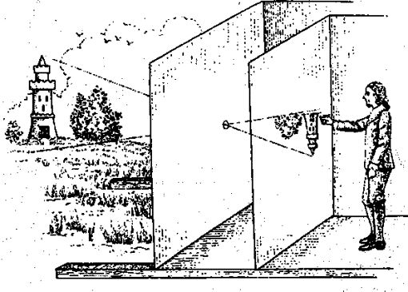{width=100%}
:::
::::::

## Camera obscura kao alat

:::::: columns
::: {.column width="52%"}
- Leonardo da Vinci detaljno je opisuje početkom XVI. stoljeća
- U XVI. i XVII. stoljeću usavršava se:
    - **konveksna leća** u otvoru
    - **zrcalo** koje ispravlja izvrnutu sliku
    - **mutno staklo** na koje se slika projicira
- Slikari je koriste za što vjerniji prikaz stvarnosti
:::
::: {.column width="46%"}
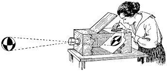{width=100%}
:::
::::::

## Prva fotografija

- Ideja: na mjesto projekcije postaviti **fotoosjetljivi materijal** (bitumen, kasnije spojevi srebra)
    - nakon dovoljno duge ekspozicije slika ostaje trajno zabilježena
- **Nicéphore Niépce**, *Pogled s prozora u Le Grasu* (1826./1827.)
    - prva sačuvana fotografija
    - heliografija: kositrena ploča premazana bitumenom koji se na svjetlu stvrdnjava
    - ekspozicija **najmanje osam sati**; rekonstrukcija postupka upućuje na **tri ili više dana**
    - sunce osvjetljava zgrade na **suprotnim stranama** dvorišta --- prešlo je nebom tijekom ekspozicije
- **1839.** --- javno predstavljena dagerotipija (Daguerre)
    - iste godine Talbot razvija postupak **negativ--pozitiv**, temelj klasične fotografije

## Pogled s prozora u Le Grasu

\begin{center}
\resizebox{\textwidth}{!}{\includegraphics[height=5cm]{slike/Point_de_vue_du_Gras-orig.jpg}\hspace{0.3cm}\includegraphics[height=5cm]{slike/Point_de_vue_du_Gras-contrast.jpg}}

\vspace{0.5ex}
{\small\itshape Lijevo: izvorna ploča danas; desno: Gernsheimova retuširana reprodukcija (1952.)}
\end{center}

## Fotografski film

- Prozirna podloga s fotoosjetljivim slojem **srebrnog halogenida**
- Osvjetljavanjem nastaje nevidljivi (latentni) zapis scene
    - razvijanjem se dobiva **negativ**, a printanjem pozitiv
- Veličina kristala (zrno) određuje razinu detalja
    - veći kristal --- veća osjetljivost, manje detalja

\vspace{1ex}

\begin{deklaracija}
Negativ je \textbf{jedinstveni fizički izvornik}: retuš, montaža ili izrezan okvir ostavljaju materijalni trag, a svaki otisak može se usporediti s negativom.
\end{deklaracija}

## Digitalna fotografija

- **1969.** --- CCD senzor (Boyle i Smith, Bell Labs; Nobelova nagrada 2009.)
- **1975.** --- prvi prototip digitalnog fotoaparata (Steven Sasson, Kodak)
    - 0,01 megapiksela, 23 sekunde za zapis jedne slike na kasetu
- **CMOS** senzori razvijaju se usporedno
    - dugo lošiji od CCD-a, danas dominiraju: jeftiniji, manja potrošnja energije
- Početkom 2000-ih prodaja digitalnih aparata prestiže klasične
- Danas većina fotografija nastaje na **pametnom telefonu**

## CCD i CMOS senzori

```{=latex}
\footnotesize
```

| | **CCD** | **CMOS** |
|:-----------|:------------------------------|:------------------------------|
| Očitanje | naboj se serijski prenosi do jednog izlaza; A/D izvan čipa | svaki piksel ima vlastito pojačalo; A/D na čipu |
| Faktor ispune | velik --- gotovo cijela površina osjetljiva | manji --- tranzistori u pikselu (mikroleće, BSI) |
| Šum | nizak, ujednačen odziv | šum uzorka po stupcima; danas usporediv |
| Potrošnja, brzina | visoka potrošnja, sporije | niska potrošnja, brzo --- video |
| Zatvarač | globalni | najčešće *rolling shutter* (redak po redak) |
| Primjena danas | znanstvene i specijalne kamere | mobiteli, fotoaparati, video |

\begin{deklaracija}
Za forenziku: oba imaju jedinstveni šum senzora; CMOS ostavlja i tragove očitanja redak po redak.
\end{deklaracija}

## Digitalna fotografija

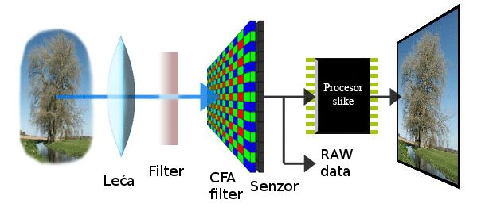{width=78%}

- Leća → filtri → senzor → procesor slike → datoteka
- Svaki korak ostavlja **karakteristične tragove** u slici
- Detaljno u predavanjima 2 i 3

## Računalna fotografija

- Fotografija s mobitela rijetko je **jedna ekspozicija**
    - spajanje više okvira (HDR, noćni način rada)
    - umjetno zamućenje pozadine (portretni način)
    - „poboljšanje" slike neuronskim mrežama
- Slika koju korisnik vidi rezultat je složene algoritamske obrade

\vspace{1ex}

\begin{deklaracija}
Granica između \textbf{akvizicije} i \textbf{obrade} postaje nejasna: i „izvorna" fotografija već je algoritamski obrađena.
\end{deklaracija}

# Stvarnost i privid

## Manipulacija starija od fotografije

- Težnja da se prikazom upravlja porukom postojala je i prije fotografije
    - **slikari i kipari** stoljećima prikazuju vladare onako kako to vlast želi
    - idealizirano lice i tijelo, vječna mladost, herojski prizori
- Fotografija se doživljava kao **mehanički, objektivan zapis**
    - upravo zato je manipulacija fotografijom toliko učinkovita
- Prve manipulacije javljaju se **nedugo nakon izuma** fotografije

## Napoleon prelazi Alpe

:::::: columns
::: {.column width="56%"}
\begin{center}
\resizebox{\linewidth}{!}{\includegraphics[height=6cm]{slike/david_napoleon_1801.jpg}\hspace{0.2cm}\includegraphics[height=6cm]{slike/delaroche_napoleon_1850.jpg}}

\vspace{0.3ex}
{\scriptsize\itshape Lijevo: J.-L. David, 1801.; desno: P. Delaroche, 1850.}
\end{center}
:::
::: {.column width="42%"}
```{=latex}
\small
```

**David** --- naslikano po Napoleonovoj želji: „miran, na vatrenom konju"

- konj u propnju, oluja, gesta prema vrhu
- u stijeni uklesana imena Hanibala i Karla Velikog

**Povijesni zapisi** (svibanj 1800.)

- prijevoj prelazi **na mazgi**, uz lokalnog vodiča
- za lijepog vremena, nekoliko dana **nakon** vojske

**Delaroche** --- prikaz prema povijesnim izvorima
:::
::::::

## Hippolyte Bayard, *Autoportret utopljenika* (1840.)

:::::: columns
::: {.column width="36%"}
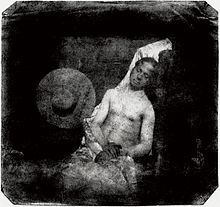{width=82%}
:::
::: {.column width="62%"}
- Bayard razvija vlastiti postupak izravnog pozitiva, ali priznanje odlazi Daguerreu
- U znak protesta inscenira vlastitu smrt --- tekst na poleđini tvrdi da se izumitelj utopio
- **Prva poznata „lažna vijest" fotografijom**
:::
::::::

\begin{deklaracija}
Slika je autentična --- laž je u \textbf{kontekstu}. Manipulacija ne mora mijenjati sadržaj slike.
\end{deklaracija}

## Tehnike u tamnoj komori

:::::: columns
::: {.column width="49%"}
**Dvostruka ekspozicija**

- Negativ se izlaže dva ili više puta
- Izvorno tehnička potreba: dijelovi scene traže različitu ekspoziciju (građevina i nebo)
- Kombiniranjem nekoliko scena nastaje **nepostojeća** slika
:::
::: {.column width="49%"}
**Kombinirani ispis** (*combination printing*)

- Nastaje kao umjetnička tehnika
- Dva ili više negativa, svaki osvijetljen samo djelomično
- Kombiniraju se u jednu fotografiju
- Izuzetno složen i zahtjevan postupak
:::
::::::

## Kombinirani ispis --- Rejlander (1857.)

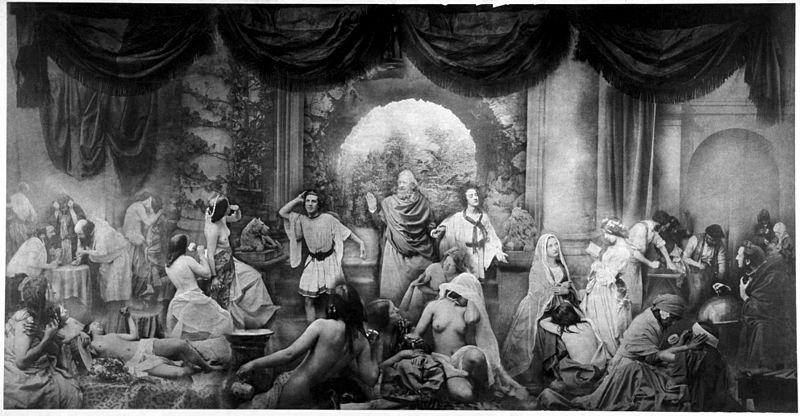{width=88%}

## Kombinirani ispis --- Robinson (1877.)

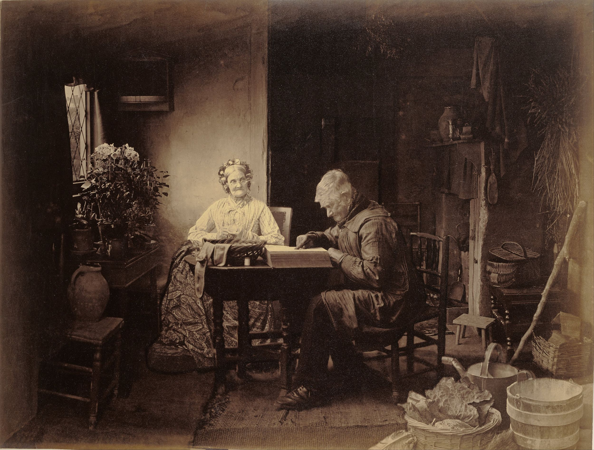{height=74%}

## Fotografija u službi vlasti

- Vlade i režimi rano prepoznaju moć fotografije
    - nijedan medij do tada nije tako izravno prenosio poruku
- Vladari se prikazuju **uljepšano** ili u **drugačijem kontekstu**
- Osobe koje padnu u nemilost **nestaju s fotografija**
- Manipulacija postaje oružje:
    - širenje netočnih informacija i propagande
    - promjena povijesnih činjenica
    - upravljanje kolektivnom sviješću

## Lincoln (oko 1865.)

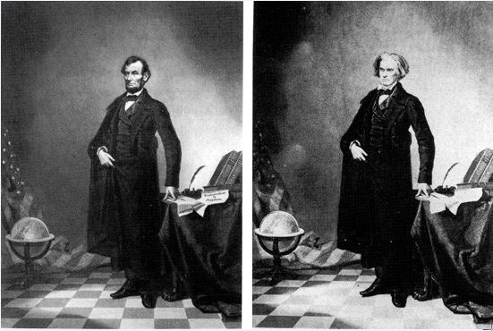{height=66%}

## Hitler i Goebbels (1937.)

\begin{center}
\makebox[\textwidth][c]{\includegraphics[width=0.97\paperwidth]{slike/hitler_goebbels.jpg}}

\vspace{0.5ex}
{\small\itshape Lijevo: objavljena verzija; desno: izvornik --- Goebbels je uklonjen s fotografije}
\end{center}

## Zastava nad Reichstagom (1945.)

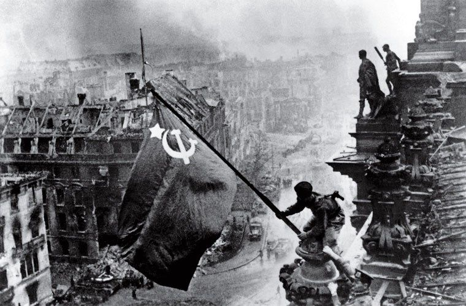{height=68%}

## Zastava nad Reichstagom --- detalj

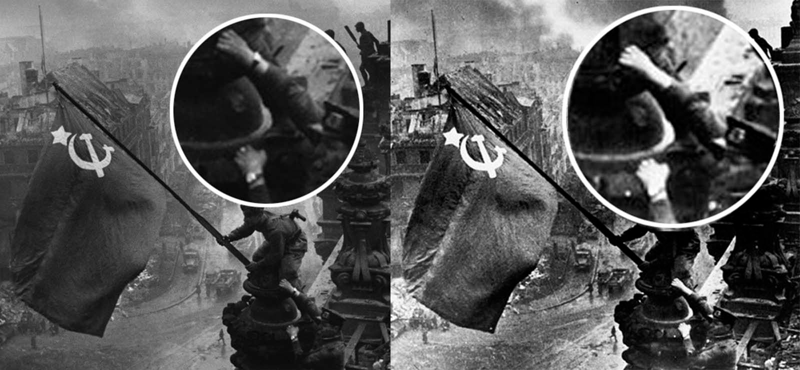{width=94%}

## Retuš u popularnoj kulturi

\begin{center}
\includegraphics[height=0.66\textheight]{slike/beatles_s_cigaretom.jpg}\hspace{1.5em}\includegraphics[height=0.66\textheight]{slike/beatles_bez_cigarete.jpg}

\vspace{1ex}
{\small\itshape Omot singla \textit{I Want to Hold Your Hand} (1964.): lijevo izvornik, desno kasnija verzija}
\end{center}

## Retuš u popularnoj kulturi --- Abbey Road

\begin{center}
\includegraphics[height=4.4cm]{slike/abbey_road_plakat.jpg}\hspace{0.4cm}\includegraphics[height=5.42cm]{slike/abbey_road_izvornik.jpg}

\vspace{0.5ex}
{\small\itshape Lijevo: plakat (2003.); desno: izvorni omot albuma}
\end{center}

## Manipulacija u digitalnom dobu

- Složeni postupci u tamnoj komori zamijenjeni su **promjenom vrijednosti piksela**
- Specijalizirani programi omogućuju manipulaciju i osobama bez stručnog znanja
- Internet i društvene mreže:
    - manipulirani sadržaj u kratkom roku dolazi do velikog broja ljudi
    - ispravak rijetko stigne do svih koji su vidjeli lažnu verziju
- Poznati slučajevi u novinarstvu:
    - **2003.**, *Los Angeles Times* --- fotoreporter spojio dvije snimke iz Iraka, otpušten
    - **2006.**, *Reuters* --- klonirani dim nad Bejrutom; agencija povukla sve fotografije autora

## Testiranje raketa Shahab-3 (2008.)

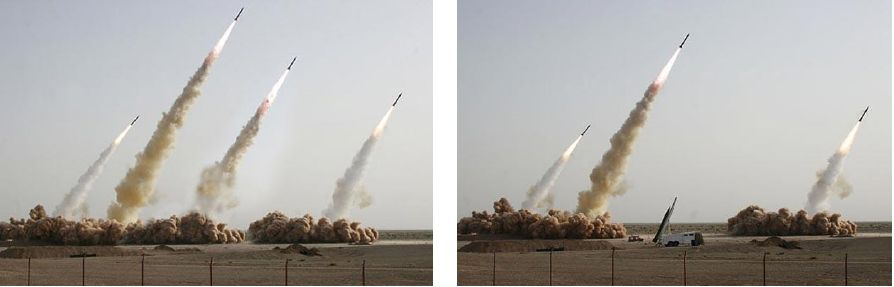{width=94%}

## Predizborni spot (2004.)

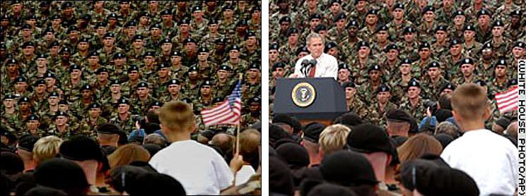{width=90%}

## Predizborni spot --- klonirani segmenti

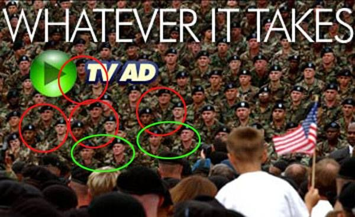{height=74%}

# Forenzika digitalne fotografije

## Manipulacija digitalnim podacima

Priroda digitalnih podataka dovodi u pitanje vjerodostojnost koja se tradicionalno pripisivala fotografiji:

- Lako mijenjanje pohranjenih podataka
- Alati dostupni i neiskusnim korisnicima
- Nema vidljivih tragova izmjene na mediju pohrane (nema negativa, nema foto papira)

\vspace{1ex}

\begin{deklaracija}
Manipulacija slikom postoji oduvijek, ali nikada nije bilo tako lako promijeniti sadržaj fotografije --- često do te mjere da vizualno nije moguće razlikovati autentičnu fotografiju od krivotvorine.
\end{deklaracija}

## Zašto je to važno?

Moderno društvo donosi ključne odluke na temelju vizualnih materijala:

- **Pravosuđe** --- fotografija i video kao dokaz na sudu
- **Novinarstvo** --- vjerodostojnost izvještavanja
- **Osiguranje** --- fotografije kao dokaz štete u prijavama
- **Znanost** --- manipulirane slike u znanstvenim radovima (mikroskopija, elektroforeza)
- **Javno mnijenje** --- stvaranje stava o ljudima i događajima

## Forenzika digitalnih podataka

- Digitalna priroda olakšava manipulaciju, ali **omogućuje i računalnu analizu**
    - računalno semantičko razumijevanje slike još je daleko od ljudskog
    - ali otkrivanje nedosljednosti matematičkim metodama nadilazi ljudsku percepciju

\vspace{1ex}

\begin{deklaracija}
Manipulacija digitalnom slikom ostavlja karakteristične tragove. Ti tragovi u pravilu nisu vidljivi ljudskom oku, ali se mogu otkriti računalnom analizom podataka.
\end{deklaracija}

- **Cilj forenzičke analize** digitalne slike je utvrđivanje vjerodostojnosti digitalnih vizualnih podataka

## Dva temeljna pitanja

```{=latex}
\large
```

1. **Odakle slika dolazi?**
2. **Je li i na koji način slika obrađivana nakon akvizicije?**

```{=latex}
\normalsize
\vspace{1ex}
```

- Digitalna slika nastaje složenim procesom koji kontinuiranu scenu preslikava u diskretnu reprezentaciju
- Slika sadrži dvije vrste informacija:
    - **semantički sadržaj** --- ono što čovjek u slici vidi i tumači
    - **tragove nastanka** --- bez semantičkog značenja, ali nose informaciju o načinu akvizicije i opremi

## Obrada i manipulacija

- **Obrada** --- postupak koji mijenja sliku, ali **ne mijenja semantički sadržaj**
    - podešavanje kontrasta, balansa bijele, oštrine; ponovno spremanje
- **Manipulacija** --- promjena **semantičkog sadržaja** kojom se narušava vjerodostojnost slike
    - dodavanje, uklanjanje ili premještanje objekata
- Granica nije uvijek oštra:
    - izrezivanje kadra može promijeniti značenje scene
    - lokalna obrada može sakriti detalj
    - računalna fotografija „izmišlja" detalje već u uređaju

## Autentična datoteka i autentična fotografija

- **Autentična digitalna datoteka** --- izvorna datoteka nastala u uređaju za snimanje
- **Autentična fotografija** --- izvorno snimljena fotografija bez ikakvih slučajnih ili namjernih promjena sadržaja

\vspace{1ex}

\begin{deklaracija}
Promjenom digitalne datoteke fotografija može ostati autentična --- npr. ponovnim spremanjem, promjenom formata ili uklanjanjem metapodataka pri objavi na društvenoj mreži.
\end{deklaracija}

- Zato je važno razlikovati **integritet datoteke** od **vjerodostojnosti sadržaja**

## Otkrivanje izvora

- Određuje **način nastanka** fotografije i karakteristike opreme
    - **tip uređaja** (proizvođač, model) ili
    - **konkretan uređaj** kojim je fotografija snimljena
- Tragovi koje koristimo:
    - metapodaci u datoteci
    - distorzija optike objektiva
    - šum senzora --- „otisak prsta" pojedinog senzora
    - karakteristike CFA filtra i algoritma interpolacije
    - neispravni pikseli
    - kvantizacijske tablice i struktura datoteke

## Potvrda autentičnosti --- vrste manipulacija

- **Umetanje** (*splicing*) --- dijelovi druge fotografije lijepe se u sliku
- **Kloniranje** (*copy-move*) --- dio slike kopira se na drugo mjesto u istoj slici
- **Uklanjanje** --- brisanje objekata, popunjavanje pozadine
- **Retuš** --- lokalne izmjene izgleda (lice, tijelo, predmeti)
- **Geometrijske izmjene** --- premještanje, rotacija, skaliranje dijelova
- **Promjena konteksta** --- lažan opis, datum ili mjesto autentične slike
- **Sintetički sadržaj** --- slika nastala bez kamere (AI)

## Potvrda autentičnosti --- metode

- Analiza nedosljednosti **sadržaja scene**
    - osvjetljenje i sjene, perspektiva, kromatska aberacija
- Analiza **digitalnog zapisa**
    - nedosljednosti u kvantizacijskim tablicama
    - tragovi višestruke kompresije
    - lokalne razlike u šumu i interpolaciji
- Analiza **datoteke**
    - nedosljednosti formata, veličina i struktura zapisa
    - metapodaci, tragovi aplikacija za obradu

## Razine analize

\begin{center}
\begin{tikzpicture}[
  razina/.style={draw=fesbSvijetla!60, fill=fesbSvijetla!8, rounded corners=3pt,
                 minimum height=1.2cm, align=left, inner sep=6pt,
                 text width=0.72\paperwidth}]
  \node[razina] (s) at (0,0)    {\textbf{Sadržaj scene} --- svjetlo, sjene, geometrija, fizika\\{\footnotesize\color{fesbSiva} ono što vidi i čovjek}};
  \node[razina] (z) at (0,-1.45) {\textbf{Digitalni zapis} --- pikseli, šum, kompresija, interpolacija\\{\footnotesize\color{fesbSiva} statistika signala, nevidljiva oku}};
  \node[razina] (d) at (0,-2.9) {\textbf{Datoteka} --- format, zaglavlja, metapodaci, struktura\\{\footnotesize\color{fesbSiva} bajtovi na disku}};
\end{tikzpicture}
\end{center}

- Nalaz je pouzdaniji kada se tragovi s **različitih razina** međusobno potvrđuju

## Aktivna i pasivna forenzika

:::::: columns
::: {.column width="49%"}
**Aktivna forenzika**

- Informacija o autentičnosti ugrađuje se **pri nastanku** slike
    - digitalni vodeni žig
    - kriptografski potpis
- Pouzdana, ali samo ako je uređaj ili alat to podržavao
:::
::: {.column width="49%"}
**Pasivna (slijepa) forenzika**

- Nema dodatne informacije --- analizira se samo ono što slika i datoteka sadrže
- Primjenjiva na bilo koju sliku
- Temelji se na tragovima koje proces nastanka i obrade nenamjerno ostavlja
:::
::::::

## Kontraforenzika

- Cilj forenzike: otkriti **sve postupke** korištene pri akviziciji i obradi slike
- Cilj krivotvoritelja: **prikriti** radnje kojima je promijenjen sadržaj i poruka slike

\begin{deklaracija}
Kontraforenzika je svaki postupak koji ugrožava dostupnost ili korisnost tragova koji se koriste u forenzičkoj analizi.
\end{deklaracija}

- Primjeri: brisanje ili krivotvorenje metapodataka, ponovna kompresija, dodavanje šuma, izmjena heksadecimalnog zapisa, napadi na automatske detektore
- Razvoj forenzičkih metoda povlači razvoj tehnika prikrivanja --- **utrka u naoružanju**

# Video i forenzika videa

## Od slike do videa

- Video je niz slika (okvira) prikazanih dovoljno brzo da stvore dojam pokreta
    - tipično 25, 30 ili 60 okvira u sekundi
- Nekomprimirani video zauzima ogroman prostor:

$$1920 \times 1080 \times 3\,\text{B} \times 30\,\tfrac{\text{okv}}{\text{s}} \approx 187\,\tfrac{\text{MB}}{\text{s}} \approx 1{,}5\,\tfrac{\text{Gbit}}{\text{s}}$$

- Kompresija je neizbježna --- i znatno složenija nego kod fotografije
    - susjedni okviri su gotovo jednaki → kodira se **razlika** između njih

## Međuokvirna kompresija

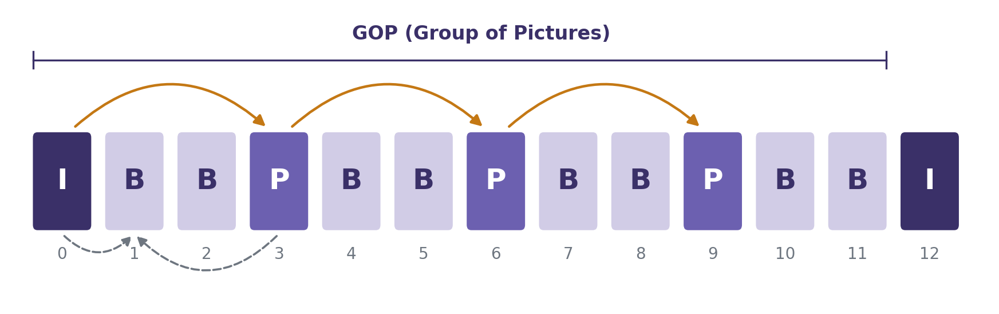{width=86%}

- **I** --- kodiran samostalno, kao slika (slično JPEG-u)
- **P** --- predviđen iz prethodnog okvira; zapisuje se pomak blokova i ostatak
- **B** --- predviđen iz prethodnog i sljedećeg okvira

## Kontejner i kodek

- **Kodek** --- način kompresije slike i zvuka
    - H.264/AVC, H.265/HEVC, AV1, VP9
- **Kontejner** --- format datoteke koji objedinjuje video, zvuk, titlove i metapodatke
    - MP4, MOV, MKV, AVI
- Forenzički zanimljivo:
    - metapodaci kontejnera (uređaj, datum, lokacija, aplikacija)
    - redoslijed i struktura blokova u datoteci --- različiti uređaji i aplikacije ostavljaju **različit potpis**

## Manipulacija videom

- **Vremenska** manipulacija
    - brisanje, umetanje ili dupliciranje okvira
    - montaža isječaka, promjena brzine reprodukcije
- **Prostorna** manipulacija unutar okvira
    - uklanjanje ili dodavanje objekata kroz niz okvira
- **Zamjena lica i glasa** (*deepfake*)
- **Promjena konteksta** --- stari snimak predstavljen kao novi događaj
    - danas vjerojatno najčešći oblik dezinformacije videom

## Tragovi manipulacije videom

- **Struktura kompresije**
    - poremećen GOP uzorak nakon brisanja ili umetanja okvira
    - tragovi dvostruke kompresije
- **Vremenski kontinuitet**
    - skokovi u kretanju, sjenama, šumu senzora između okvira
- **Zvuk i slika**
    - sinkronizacija usana i govora, akustika prostora
- **ENF analiza** (*Electric Network Frequency*)

## ENF analiza

- Frekvencija električne mreže nazivno je **50 Hz** (Europa) ili **60 Hz** (SAD), ali stalno lagano oscilira
    - oscilacije su jednake u cijeloj mreži i bilježe ih operatori
- Brujanje mreže ulazi u **zvučni zapis**, a treperenje rasvjete u **sliku**
- Usporedbom s arhivom mrežne frekvencije može se utvrditi:
    - **vrijeme** nastanka snimke
    - mjesta **rezova** i umetanja --- diskontinuitet u ENF krivulji

# Forenzika danas i sutra: AI generirani sadržaj

## Generirano, a ne snimljeno

```{=latex}
\large
```

- Klasična forenzika pita: **što je u slici promijenjeno?**
- Kod generiranog sadržaja nema izvornika, nema kamere, nema scene

```{=latex}
\normalsize
\vspace{1.5ex}
```

\begin{deklaracija}
Pitanje se mijenja: \textbf{je li ova slika uopće nastala snimanjem stvarnog svijeta?}
\end{deklaracija}

## Kratka povijest generativnih modela

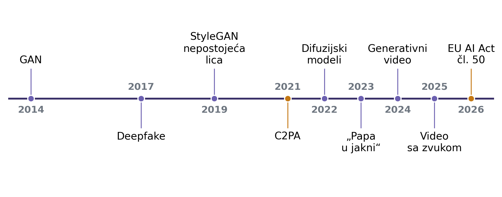{width=100%}

## GAN --- generativne suparničke mreže

- **2014.** --- Goodfellow i suradnici
- Dvije mreže u nadmetanju:
    - **generator** stvara slike
    - **diskriminator** pokušava razlikovati stvarne slike od generiranih
- Generator uči „prevariti" diskriminator --- slike postaju sve uvjerljivije
- **StyleGAN** (NVIDIA, 2019.) --- fotorealistična lica osoba koje **ne postoje**
    - prvi masovni izvor lažnih profilnih fotografija

## Difuzijski modeli

- Model uči **postupno uklanjati šum**: od slučajnog šuma korak po korak nastaje slika
- Upravljanje **tekstualnim opisom** (*text-to-image*)
- **2022.** --- DALL·E 2, Midjourney, Stable Diffusion
    - fotorealističan sadržaj dostupan svakome, u sekundama, bez ikakvog znanja
- Uz generiranje: **uređivanje** stvarnih fotografija (*inpainting*)
    - uklanjanje ili dodavanje objekata opisom --- AI kao alat za klasičnu manipulaciju

## AI slike u javnosti

- **Ožujak 2023.** --- papa Franjo u bijeloj pernatoj jakni
    - generirano Midjourneyjem, milijuni pregleda, mnogi su povjerovali
- **Svibanj 2023.** --- lažna fotografija eksplozije kod Pentagona
    - proširila se preko profila s oznakom „provjereno", burza je nakratko pala
- Obrazac: **uvjerljivo + brzo širenje + nema izvornika** koji bi se mogao provjeriti

## AI video i deepfake

- **2017.** --- pojam *deepfake*: zamjena lica u videu dubokim učenjem
- **2022.** --- lažna snimka predsjednika Zelenskog koji poziva na predaju
- **2024.** --- prijevara u Hong Kongu: zaposlenik uplatio ~25 mil. USD nakon video poziva s lažnim financijskim direktorom i kolegama
- **Generativni video** iz tekstualnog opisa
    - Sora (2024.); Veo 3 (2025.) generira i sinkronizirani zvuk
- Kloniranje glasa iz nekoliko sekundi snimke

## Detekcija I --- vizualni artefakti

- Tipične pogreške generativnih modela:
    - ruke i prsti, tekst i natpisi, nakit, odrazi u zrcalima i očima
    - nelogične sjene, pozadina koja se „raspada", narušena fizika scene
- **Ograničenje:** svaka nova generacija modela ispravlja dio pogrešaka

\vspace{1ex}

\begin{deklaracija}
Odsutnost vidljivih artefakata \textbf{nije dokaz} autentičnosti. Vizualna procjena može biti polazište, ali nikada jedini kriterij.
\end{deklaracija}

## Detekcija II --- tragovi u signalu

- Generirana slika nije prošla kroz **stvarni cjevovod kamere**
    - nema otiska šuma senzora
    - nema uzorka interpolacije CFA filtra
    - statistika šuma razlikuje se od stvarne snimke
- Arhitektura generatora ostavlja tragove
    - operacije povećanja rezolucije (*upsampling*) stvaraju **periodične uzorke u frekvencijskoj domeni**
- Iste metode koje razvijamo za klasičnu forenziku --- primijenjene na novi problem

## Detekcija III --- naučeni detektori

- Klasifikatori (duboke mreže) učeni na stvarnim i generiranim slikama
- Problemi:
    - **generalizacija** --- detektor učen na jednom modelu često zakaže na novom
    - **osjetljivost na obradu** --- kompresija i promjena veličine brišu tragove
    - **lažno pozitivni** nalazi --- stvarna slika proglašena generiranom

\vspace{1.5ex}

\begin{deklaracija}
\textbf{Neprozirnost:} teško je objasniti \textit{zašto} je detektor donio odluku --- a nalaz koji se ne može obrazložiti teško je braniti.
\end{deklaracija}

## Detekcija deepfake videa

- Prostorni tragovi u pojedinom okviru
    - granica zamijenjenog lica, nekonzistentna boja kože i osvjetljenje
- **Vremenski** tragovi kroz niz okvira
    - treperenje, nestabilni detalji (kosa, zubi, naočale)
    - nekonzistentni pokreti glave i lica
- Zvuk i slika --- sinkronizacija usana, prirodnost glasa
- Fiziološki signali --- npr. puls vidljiv kao suptilna promjena boje kože
- Rane „prepoznatljive" pogreške (npr. izostanak treptanja) davno su ispravljene

## Digitalna provenijencija

- Umjesto „je li slika lažna?" --- **može li se dokazati odakle je?**
- **C2PA / Content Credentials**
    - kriptografski potpisan zapis o nastanku i uređivanju sadržaja
    - podržavaju ga pojedini fotoaparati, alati za obradu i generativni modeli
    - ograničenje: zapis se lako ukloni, a njegova odsutnost ne dokazuje krivotvorenje
- **Nevidljivi vodeni žigovi** u pikselima (npr. SynthID)
    - otporniji na obradu od metapodataka
    - postoje samo ako ih je model koji je generirao sadržaj ugradio

## Ograničenja i nove opasnosti

- Društvene mreže **rekomprimiraju** i smanjuju sadržaj --- tragovi nestaju
- Detektori i generatori razvijaju se u stalnoj **utrci**
- **Liar's dividend** („dividenda lažljivca")
    - kada svi znaju da je sve moguće lažirati, **autentičan** snimak može se odbaciti kao lažan
    - posljedica ne pogađa samo lažni sadržaj, nego i povjerenje u stvarne dokaze

## Regulativa --- EU AI Act

- **Članak 50** --- obveze transparentnosti, na snazi od **2. kolovoza 2026.**
- Pružatelji generativnih sustava
    - sadržaj mora biti **strojno čitljivo označen** kao umjetno generiran
    - sustavi na tržištu prije 2. 8. 2026. --- od **2. prosinca 2026.**
- Korisnici koji objavljuju deepfake sadržaj
    - obveza **vidljive oznake**, bez prijelaznog razdoblja
- Kodeks prakse za označavanje AI sadržaja (2026.) --- dobrovoljni alat za usklađivanje
- Kazne do 15 mil. EUR ili 3 % ukupnog godišnjeg prometa

## Budućnost forenzike slike

- Nijedna metoda sama nije dovoljna --- **kombinacija** pristupa:
    - provenijencija (potpis, vodeni žig)
    - analiza signala i datoteke
    - analiza sadržaja scene
    - provjera konteksta (izvor, vrijeme, mjesto, druge snimke istog događaja)
- Uloga forenzičara: **procjena vjerojatnosti** i jasno obrazloženje nalaza, a ne jednostavan odgovor „pravo / lažno"

# Zaključak

## Što forenzika može, a što ne

- Forenzička analiza daje **indicije** različite pouzdanosti
    - nalaz treba izraziti stupanj pouzdanosti i obrazložiti ga
    - izostanak tragova manipulacije ne dokazuje autentičnost
- Za primjenu u sudskom postupku nužan je **lanac čuvanja dokaza**
    - osiguravanje izvornika (kriptografski sažetak --- *hash*)
    - analiza isključivo na radnoj kopiji
    - dokumentiranje svih postupaka --- nalaz mora biti **ponovljiv**

## Sljedeća predavanja

- **P2 --- Uvod u digitalnu obradu i analizu slike**
    - kako vidimo, boja, zapis digitalne slike
    - osnovne operacije, histogram, poboljšanje slike, konvolucija
- **P3 --- Matematički model slike**
    - prostori boja, dijagram kromatičnosti, udaljenosti u prostoru boja
    - formati zapisa, osnove JPEG-a, JFIF i EXIF
