# Kako vidimo

## Svjetlost

- Svjetlost je **elektromagnetsko zračenje** koje podražuje fotoreceptore oka
- Ljudsko oko osjetljivo je na vrlo mali dio spektra: približno **380--750 nm**

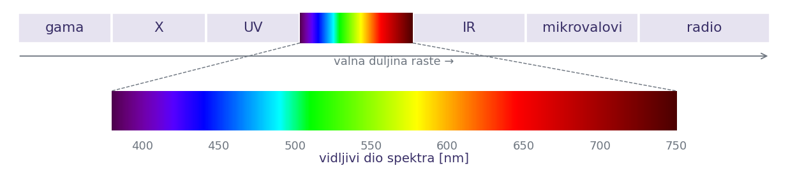{width=100%}

## Boja predmeta

- Izvor svjetla ima svoju **spektralnu raspodjelu energije** $L(\lambda)$
- Površina predmeta dio valnih duljina upija, a dio odbija: **reflektivnost** $\rho(\lambda)$
- U oko (ili kameru) stiže:

$$I(\lambda) = \rho(\lambda) \, L(\lambda)$$

- Boja koju vidimo ovisi i o predmetu **i o izvoru svjetla**
    - isti predmet pod žaruljom i pod dnevnim svjetlom daje drukčiji $I(\lambda)$
    - mozak to kompenzira; kamera mora to učiniti računski --- **balans bijele**

## Ljudski vizualni sustav

:::::: columns
::: {.column width="44%"}
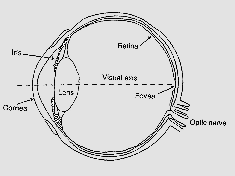{width=100%}
:::
::: {.column width="54%"}
- **Optički sustav** (rožnica, leća) fokusira sliku na mrežnicu
- **Mrežnica** pretvara svjetlost u električne signale
- **Mozak** te signale tumači

\vspace{1ex}
\includegraphics[width=\linewidth]{slike/p02_hvs_model.jpg}
:::
::::::

## Štapići i čunjići

:::::: columns
::: {.column width="49%"}
**Čunjići** --- fotopski (svijetli) vid

- 6--7 milijuna, uglavnom u žutoj pjegi
- osjetljivi na boju --- tri vrste
- svaki povezan na vlastiti živac → oštra, detaljna slika
:::
::: {.column width="49%"}
**Štapići** --- skotopski (tamni) vid

- 75--150 milijuna, raspršeni po mrežnici
- znatno osjetljiviji, ali **ne razlikuju boje**
- više štapića dijeli jedan živac → manje detalja
:::
::::::

\vspace{1ex}

\begin{deklaracija}
Pri slabom svjetlu vidimo štapićima --- zato u mraku ne raspoznajemo boje.
\end{deklaracija}

## Odziv fotoreceptora

:::::: columns
::: {.column width="55%"}
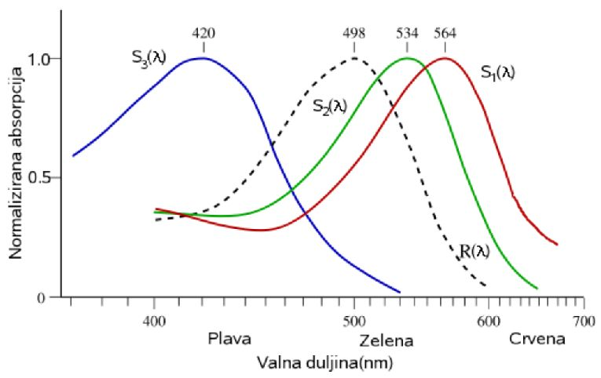{width=100%}
:::
::: {.column width="43%"}
- Tri vrste čunjića s maksimumom odziva oko **420, 534 i 564 nm**
- Odzivi se jako preklapaju
- Štapići (isprekidano): maksimum oko **498 nm**
- Model odziva triju vrsta čunjića naziva se **LMS**
:::
::::::

## Metamerizam

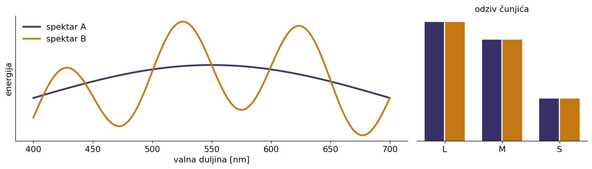{width=92%}

\begin{deklaracija}
Oko ne može rekonstruirati spektar: svjetlost svodi na \textbf{tri broja}. Fizički različita svjetlost može dati istu boju.
\end{deklaracija}

## Metamerizam --- primjer zaslona

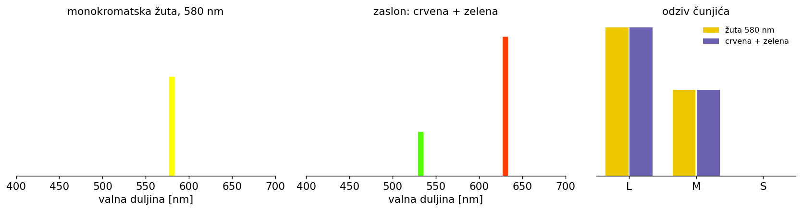{width=100%}

- Zaslon **ne emitira** žutu valnu duljinu --- samo crvenu i zelenu
- Odziv čunjića je isti, pa vidimo žutu

\begin{deklaracija}
Različiti spektri mogu dati istu boju --- zato su za zapis i prikaz boje dovoljne tri vrijednosti po pikselu.
\end{deklaracija}

# Osnove boje

## Miješanje boja

- **Trikromatska teorija:** gotovo svaka boja može se dobiti miješanjem tri primarne boje

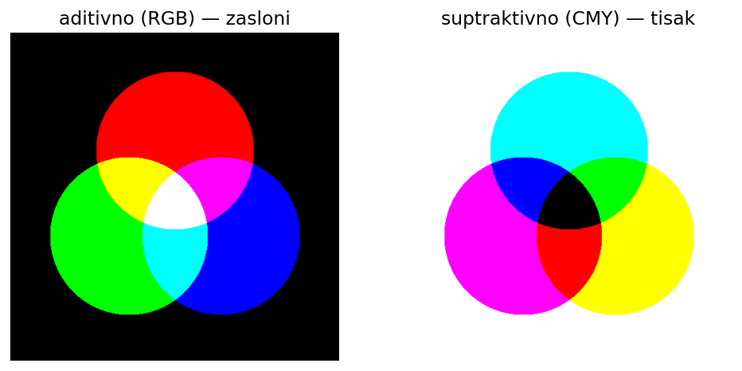{height=44%}

- **Aditivno** --- svjetla se zbrajaju (zasloni, projektori): RGB
- **Suptraktivno** --- pigmenti upijaju svjetlost (tisak): CMY + crna (K)

## RGB prostor boja

:::::: columns
::: {.column width="46%"}
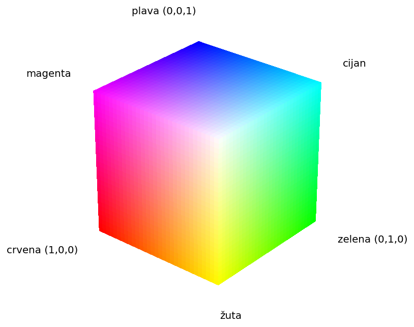{width=100%}
:::
::: {.column width="52%"}
- Svaka boja je točka u kocki $(R, G, B)$
- Crna je u ishodištu $(0,0,0)$, bijela u suprotnom vrhu $(1,1,1)$ --- na slici središnji vrh
- Dijagonala $R = G = B$ su **sive razine**
- Uz 8 bita po kanalu: $256^3 \approx 16{,}7$ milijuna boja
:::
::::::

## Iz boje u sive razine

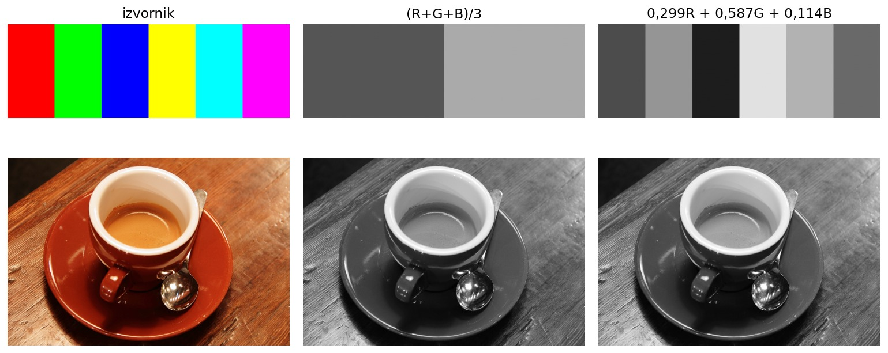{width=62%}

$$I = 0{,}299\,R + 0{,}587\,G + 0{,}114\,B$$

- Jednostavni prosjek daje istu sivu za crvenu, zelenu i plavu
- Težine prate osjetljivost oka --- najveću na zeleno (ITU-R BT.601, \texttt{cv2.cvtColor})

## Koja boja ima najviše crvene, zelene ili plave?

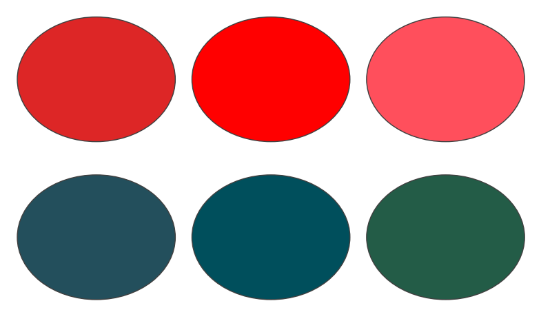{width=86%}

## Koja boja ima najviše crvene, zelene ili plave?

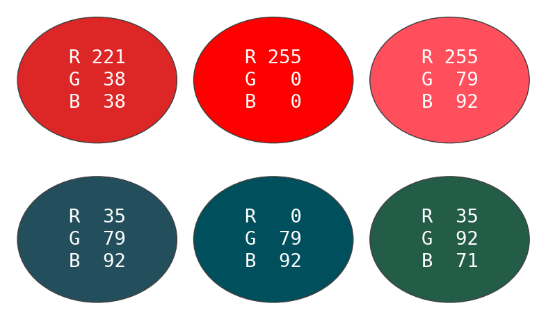{width=86%}

## Kako „mislimo" boje?

Opažanje boje opisujemo tonom, zasićenjem i svjetlinom:

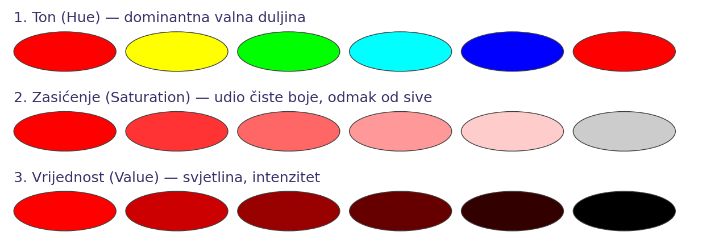{width=74%}

\begin{deklaracija}
Čovjek ne može rastaviti boju na komponente R, G i B, niti odrediti valnu duljinu. Intuitivan opis boje daju prostori HSV, HSI i HLS.
\end{deklaracija}

## HSV prostor boja

:::::: columns
::: {.column width="30%"}
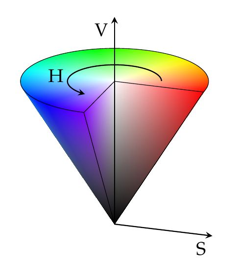{width=100%}
:::
::: {.column width="68%"}
- **H** (ton) --- kut na kružnici boja, 0--360°
    - OpenCV ga zapisuje kao 0--179, da stane u `uint8`
- **S** (zasićenje) --- udaljenost od osi sivih razina, 0--1
- **V** (vrijednost) --- položaj na osi sivih: dno je crna, vrh bijela
- Pretvorba iz RGB je nelinearna
:::
::::::

## HSV prostor boja --- primjer

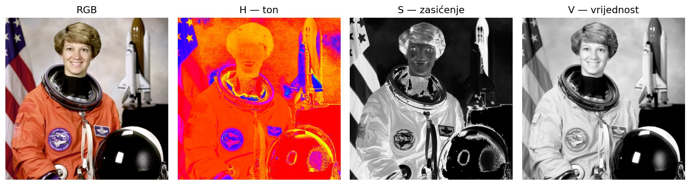{width=100%}

- Kada je S ≈ 0, **ton nije definiran** --- kanal H je šum (bijela kaciga, siva pozadina)

# Od svjetla do piksela

## Senzor i CFA filtar

:::::: columns
::: {.column width="42%"}
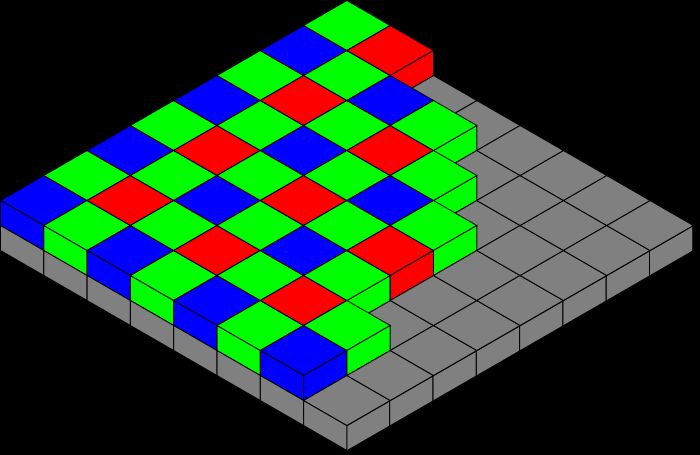{width=100%}
:::
::: {.column width="56%"}
- Fotosenzor mjeri samo **količinu svjetla**, ne i boju
- Ispred senzora je mozaik filtara boja --- **CFA** (*Color Filter Array*)
    - svaki piksel „vidi" samo jednu komponentu
- **Bayerov uzorak** (Kodak, patent 1976.):
    - 50 % zelenih, 25 % crvenih, 25 % plavih
    - zelenih je dvostruko jer oko najviše detalja vidi upravo preko zelene komponente
:::
::::::

## Demozaikiranje

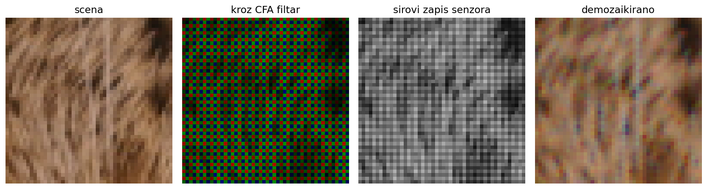{width=100%}

- U svakom pikselu **dvije od tri** vrijednosti boje interpoliraju se iz susjeda
- Na finim detaljima nastaju artefakti --- lažne boje
- Interpolacija ostavlja **pravilnu korelaciju među susjednim pikselima**, specifičnu za algoritam proizvođača --- važan forenzički trag

## Obrada u kameri

{width=62%}

- Tipični koraci: demozaikiranje → balans bijele → korekcija boja → **gama korekcija** → uklanjanje šuma, izoštravanje → kompresija
- Svaki proizvođač ove korake provodi na svoj način --- rezultat nosi **potpis uređaja**

## Gama korekcija

:::::: columns
::: {.column width="32%"}
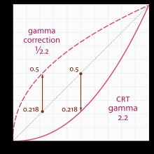{width=88%}
:::
::: {.column width="66%"}
- Kodiranje u kameri: $V_c = V_{in}^{1/\gamma}$, prikaz: $V_{out} = V_c^{\gamma}$, tipično $\gamma \approx 2{,}2$
- Izvorno kompenzira nelinearnost CRT zaslona
- Danas važnije: oko je osjetljivije na razlike u **tamnim** tonovima
    - gama kodiranje tamnim tonovima daje više od 256 raspoloživih razina
:::
::::::

\begin{center}
\includegraphics[height=0.2\textheight]{slike/p02_gama_izvornik.jpg}\hspace{0.6em}\includegraphics[height=0.2\textheight]{slike/p02_gama_primjeri.jpg}
\end{center}

## RAW i obrađena slika

:::::: columns
::: {.column width="49%"}
**RAW**

- Izravno očitanje senzora nakon A/D pretvorbe
- Jedna vrijednost po pikselu (mozaik)
- 12--14 bita, linearni odziv, bez obrade
- Format proizvođača (CR3, NEF, ARW…) ili otvoreni DNG
:::
::: {.column width="49%"}
**Obrađena slika**

- Tri kanala po pikselu (RGB)
- 8 bita po kanalu
- Demozaikirana, balansirana, gama kodirana
- Najčešće sažeta (JPEG, HEIF)
:::
::::::

\vspace{1ex}

\begin{deklaracija}
RAW je najbliži onome što je senzor zabilježio, ali ni RAW datoteka sama po sebi ne jamči autentičnost.
\end{deklaracija}

# Zapis digitalne slike

## Uzorkovanje i kvantizacija

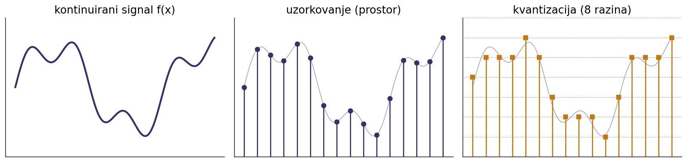{width=100%}

- **Uzorkovanje** --- kontinuirana scena mjeri se u konačnom broju točaka (piksela)
- **Kvantizacija** --- izmjerena vrijednost zaokružuje se na jednu od konačnog broja razina

## Nyquist-Shannonov teorem

\begin{deklaracija}
Ako se signal uzorkuje frekvencijom barem \textbf{dvostruko većom} od njegove najviše frekvencije, može se točno rekonstruirati iz uzoraka.
\end{deklaracija}

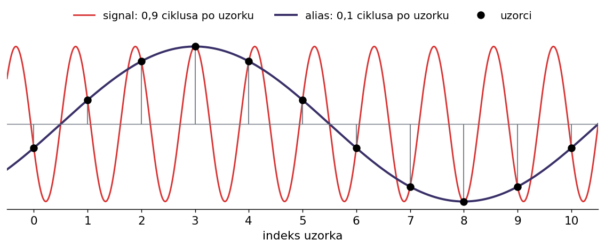{width=60%}

- Prerijetko uzorkovan brzi signal daje iste uzorke kao spori --- **aliasing**
- U slici je frekvencija uzorkovanja gustoća piksela: detalj finiji od dva piksela pojavljuje se kao lažni, grublji uzorak

## Aliasing u slici i antialiasing

\begin{center}
\resizebox{0.92\textwidth}{!}{%
\parbox[t]{6.14cm}{\centering\includegraphics[height=4cm]{slike/p02_aliasing_izvorna.jpg}\\[0.3ex]{\large\itshape izvorna slika}}\hspace{0.3cm}%
\parbox[t]{6.14cm}{\centering\includegraphics[height=4cm]{slike/p02_aliasing_bez_aa.jpg}\\[0.3ex]{\large\itshape smanjeno bez antialiasinga}}\hspace{0.3cm}%
\parbox[t]{4.57cm}{\centering\includegraphics[height=4cm]{slike/p02_aliasing_detalj.jpg}\\[0.3ex]{\large\itshape uvećani detalj}}}
\end{center}

- Cigle na tornju finije su od razmaka piksela smanjene slike → lažni valoviti uzorci (**moiré**)
- **Antialiasing:** niskopropusno filtriranje *prije* uzorkovanja (u kameri optički filtar ispred senzora)
- I lažne boje kod demozaikiranja su aliasing --- R i B uzorkovani su samo u svakom drugom pikselu

## Slika kao matrica

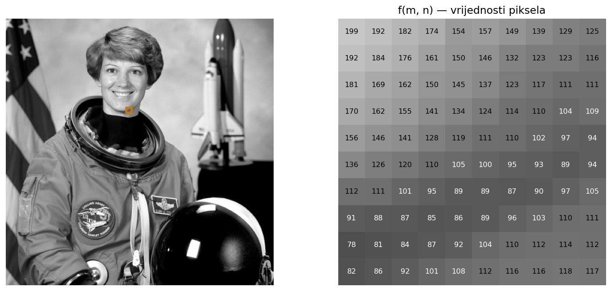{width=74%}

- Slika sivih razina je matrica $f(m, n)$: $m$ je redak, $n$ stupac, ishodište gore lijevo

## Slika u boji

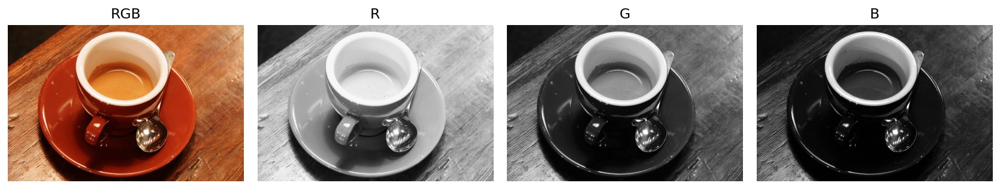{width=100%}

```python
img = cv2.imread("slika.jpg")     # POZOR: OpenCV čita kanale redom B, G, R
print(img.shape, img.dtype)       # (400, 600, 3) uint8
B, G, R = cv2.split(img)
```

- **Binarna slika** --- samo vrijednosti 0 i 1 (maske, segmentacija)

## Prostorna rezolucija i dubina boje

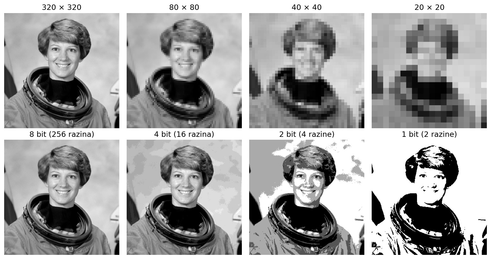{height=86%}

## Cjelobrojni zapis --- uint8

- Najčešći zapis: 8 bita po kanalu, vrijednosti **0--255**
- Što kada rezultat operacije izađe iz tog raspona?

```python
a = np.full((2, 2), 200, np.uint8)
b = np.full((2, 2), 100, np.uint8)
a + b              # 44   -> preljev (modulo 256)
cv2.add(a, b)      # 255  -> zasićenje (odsijecanje)
b - a              # 156
cv2.subtract(b, a) # 0
```

\begin{deklaracija}
Ista operacija daje različit rezultat ovisno o biblioteci --- bez ikakve poruke o pogrešci.
\end{deklaracija}

## Zašto pomični zarez?

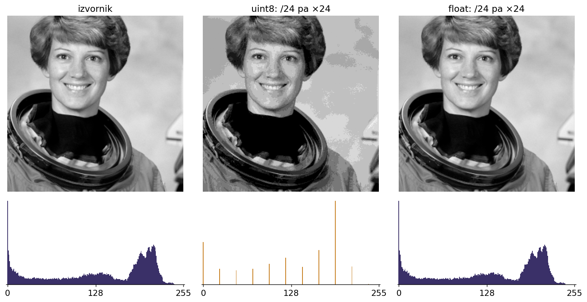{height=52%}

- Međurezultati se računaju u pomičnom zarezu, najčešće u rasponu $[0, 1]$
- U `uint8` se zaokružuje **samo jednom, na kraju** --- svako zaokruživanje trajno gubi informaciju

## Interpolacija

:::::: {.columns align=top}
::: {.column width="36%"}
**Najbliži susjed** (*nearest neighbor*)

- Novi piksel preuzima vrijednost najbližeg izvornog piksela
- Uvećanje = ponavljanje redaka i stupaca
- Ne stvara nove vrijednosti --- samo ponavlja postojeće
:::
::: {.column width="62%"}
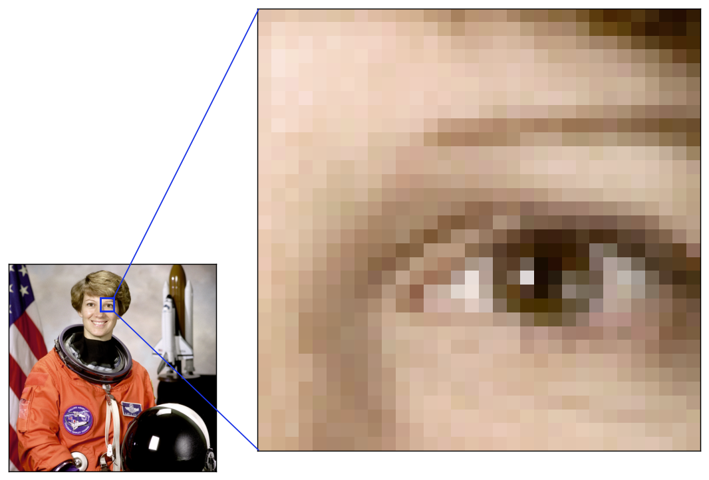{width=100%}
:::
::::::

## Interpolacija

:::::: {.columns align=top}
::: {.column width="36%"}
**Bilinearna interpolacija**

- Linearno, prvo po retcima, zatim po stupcima

\begin{center}
\small
\begin{tabular}{|c|c|}\hline A & B \\ \hline C & D \\ \hline\end{tabular}
$\rightarrow$
\begin{tabular}{|c|c|c|}\hline A & e & B \\ \hline f & g & h \\ \hline C & i & D \\ \hline\end{tabular}
\end{center}

$e = \frac{A+B}{2}, \quad i = \frac{C+D}{2}$

$g = \frac{e+i}{2} = \frac{A+B+C+D}{4}$
:::
::: {.column width="62%"}
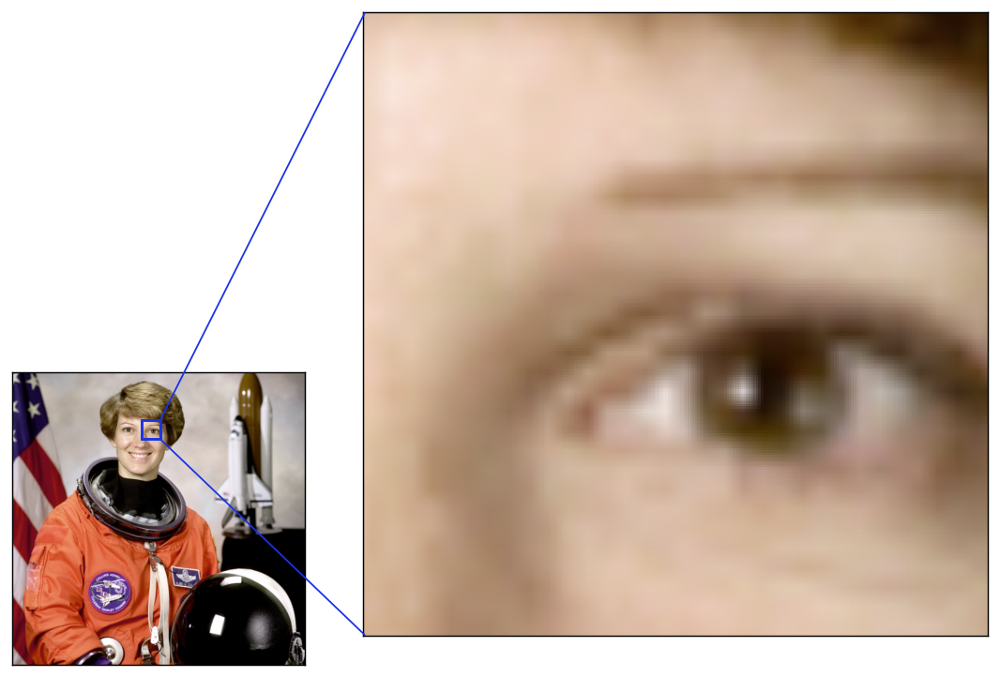{width=100%}
:::
::::::

## Interpolacija

:::::: {.columns align=top}
::: {.column width="36%"}
**Bikubična interpolacija**

- Uzima u obzir veći broj susjednih piksela: kubni polinom kroz 4 × 4 = 16 susjeda
- Oštriji rubovi od bilinearne interpolacije
:::
::: {.column width="62%"}
{width=100%}
:::
::::::

## Interpolacija

:::::: {.columns align=top}
::: {.column width="36%"}
```{=latex}
\small
```

**Lanczos (sinc) interpolacija**

$$S(x) = \sum_{i=\lfloor x \rfloor - a + 1}^{\lfloor x \rfloor + a} s_i \, L(x - i)$$

- $L(x) = \mathrm{sinc}(x)\,\mathrm{sinc}(x/a)$ za $|x| < a$
- 2D: $L(x, y) = L(x)\,L(y)$
- Približava idealnu rekonstrukciju iz Nyquist-Shannonova teorema
:::
::: {.column width="62%"}
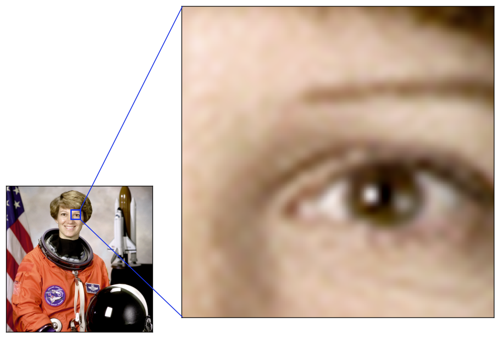{width=100%}
:::
::::::

## Područje interesa (ROI)

- Često analiziramo samo dio slike --- **ROI** (*Region of Interest*)

```python
roi = img[120:150, 100:180]         # retci 120-149, stupci 100-179
print(roi.shape)                    # (30, 80, 3)

roi[:] = 0                          # POZOR: mijenja i izvornu sliku!
roi = img[120:150, 100:180].copy()  # neovisna kopija
```

\begin{deklaracija}
U forenzičkoj analizi izvorna slika se nikada ne mijenja --- radi se isključivo na kopiji.
\end{deklaracija}

# Osnovne operacije

## Vrste operacija na slici

- **Točkaste** --- izlaz ovisi samo o pikselu na istoj koordinati

$$g(m, n) = T\big(f(m, n)\big)$$

- **Lokalne** --- izlaz ovisi o pikselu i njegovom **susjedstvu** (filtri, konvolucija)
- **Globalne** --- izlaz ovisi o **svim** pikselima slike (histogram, Fourierova transformacija)

## Točkaste operacije

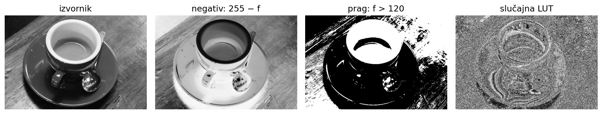{width=100%}

- **LUT** (*lookup table*) --- tablica izlaznih vrijednosti za svih 256 mogućih ulaza
    - preslikavanje je obično indeksiranje: `g = lut[f]`
    - bilo koja točkasta operacija na `uint8` slici može se zapisati kao LUT

## Razlika dviju slika

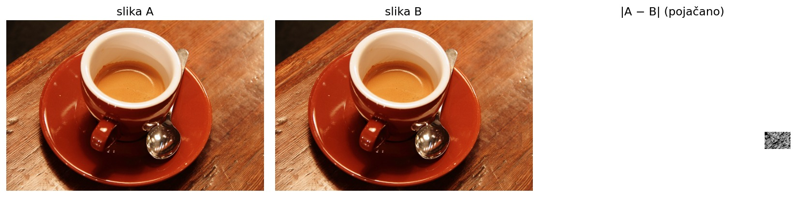{width=100%}

- Izmjenu koju oko ne primjećuje razlika odmah otkriva
- Uvjet: slike moraju biti **poravnate** i jednako zapisane --- inače razlika pokazuje sve, a ne samo izmjenu

## Geometrijske operacije

- Izrezivanje, skaliranje, rotacija, perspektivne transformacije
- Novi pikseli ne padaju na mrežu izvornih → vrijednosti se **interpoliraju**
    - najbliži susjed, bilinearna, bikubična interpolacija

```python
mala = cv2.resize(img, None, fx=0.5, fy=0.5, interpolation=cv2.INTER_AREA)
```

\begin{deklaracija}
Interpolacija uvodi periodične korelacije među pikselima --- trag koji otkriva da je dio slike skaliran ili rotiran.
\end{deklaracija}

# Histogram

## Histogram i kumulativni histogram

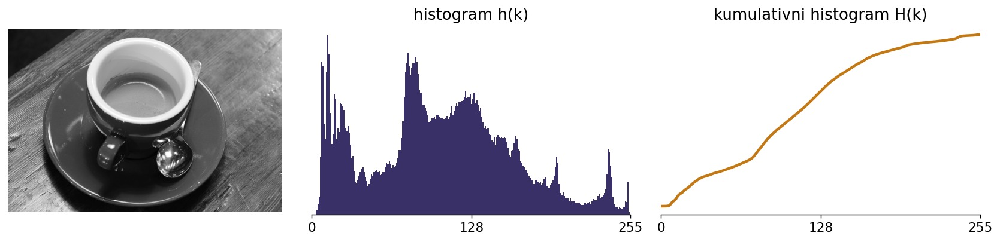{width=100%}

$$h(k) = \big|\{(m,n) : f(m,n) = k\}\big|, \qquad H(k) = \sum_{i=0}^{k} h(i)$$

```python
h = np.bincount(g.ravel(), minlength=256)    # ili cv2.calcHist
```

## Histogram slike u boji

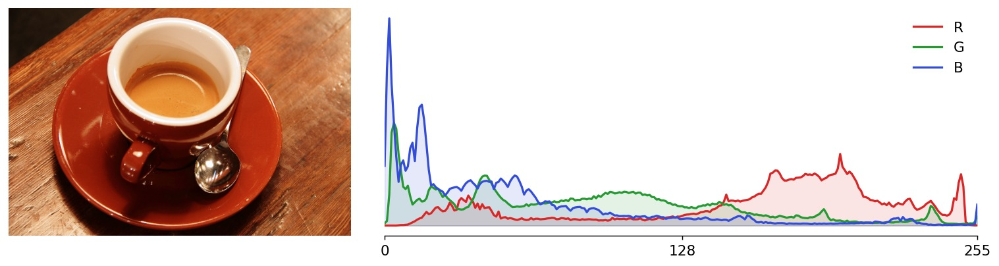{width=100%}

- Za sliku u boji računaju se tri nezavisna histograma, za svaki kanal posebno
- Višedimenzionalni histogram opisuje zajedničku raspodjelu kanala

## Histogram ne vidi prostor

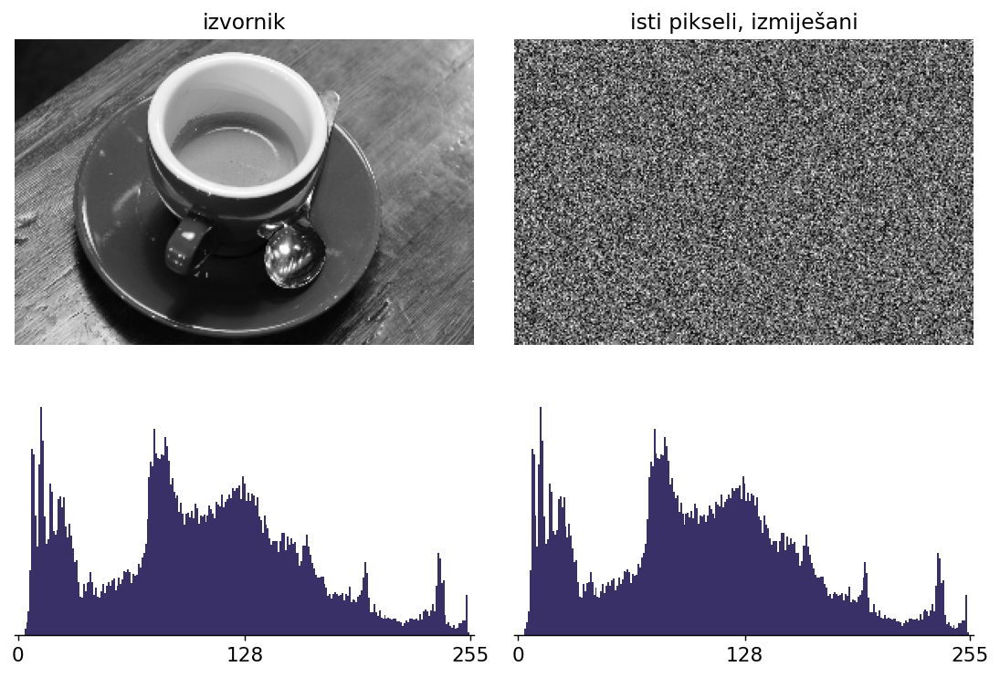{height=60%}

\begin{deklaracija}
Histogram opisuje samo \textbf{koliko} je kojih vrijednosti, a ne \textbf{gdje} su u slici.
\end{deklaracija}

## Histogram ne vidi prostor --- primjer

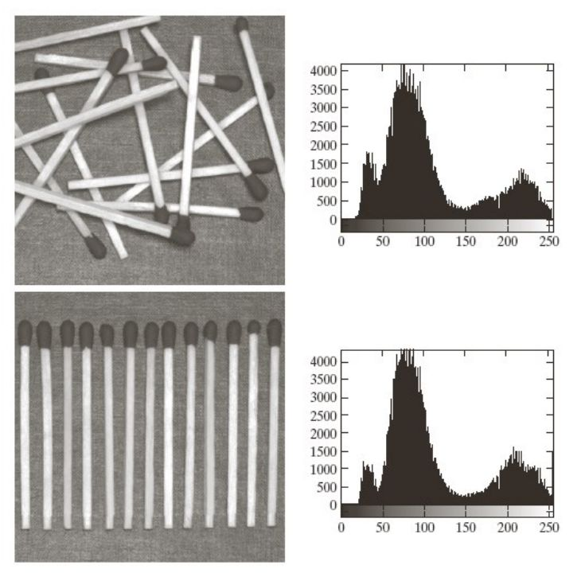{height=66%}

- Iste šibice, različito razmještene --- histogrami su gotovo jednaki

## Čitanje histograma

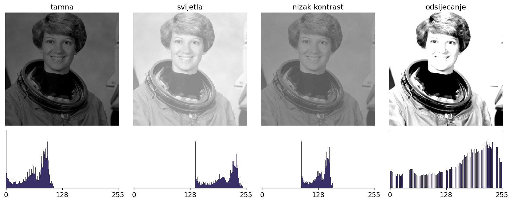{width=90%}

- **Odsijecanje:** svi pikseli izvan raspona svedeni su na 0 ili 255 --- ta informacija je nepovratno izgubljena

# Poboljšanje slike

## Rastezanje histograma

- Raspon vrijednosti $[f_{min}, f_{max}]$ preslikava se na cijeli raspon $[0, 255]$:

$$g = \frac{f - f_{min}}{f_{max} - f_{min}} \cdot 255$$

- Nekoliko krajnjih piksela može onemogućiti rastezanje
    - zato se često odbacuje mali postotak najtamnijih i najsvjetlijih (npr. 0,5 %)
- Često je ugrađeno u automatiku uređaja za prikaz

## Ujednačavanje histograma

- Cilj: histogram u kojem su sve razine približno jednako zastupljene
- Funkcija preslikavanja je **normalizirani kumulativni histogram**:

$$g(m, n) = 255 \cdot \frac{H\big(f(m, n)\big)}{M \cdot N}$$

- Postupak:
    1. izračunati kumulativni histogram $H(k)$
    2. normalizirati ga na najveću vrijednost (255)
    3. koristiti ga kao LUT

```python
eq = cv2.equalizeHist(g)
```

## Rastezanje i ujednačavanje

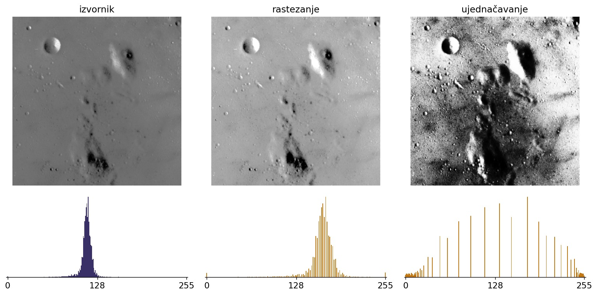{height=86%}

## Lokalno ujednačavanje histograma

\begin{center}
\parbox[t]{0.3\textwidth}{\centering\includegraphics[height=0.54\textheight]{slike/p02_lokalno_izvornik.jpg}\\[0.3ex]{\small\itshape izvornik}}\hspace{0.02\textwidth}%
\parbox[t]{0.3\textwidth}{\centering\includegraphics[height=0.54\textheight]{slike/p02_lokalno_globalno.jpg}\\[0.3ex]{\small\itshape globalno ujednačavanje}}\hspace{0.02\textwidth}%
\parbox[t]{0.3\textwidth}{\centering\includegraphics[height=0.54\textheight]{slike/p02_lokalno_lokalno.jpg}\\[0.3ex]{\small\itshape lokalno ujednačavanje}}
\end{center}

- Histogram se ujednačava zasebno u manjim područjima slike --- ističu se lokalni detalji (npr. CLAHE)

## Logaritamsko i eksponencijalno preslikavanje

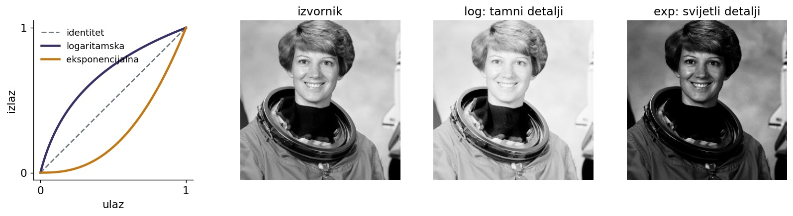{width=100%}

- **Logaritamsko** preslikavanje razvlači tamne tonove --- ističe detalje u sjenama
- **Eksponencijalno** preslikavanje razvlači svijetle tonove

## Poboljšanje ostavlja trag

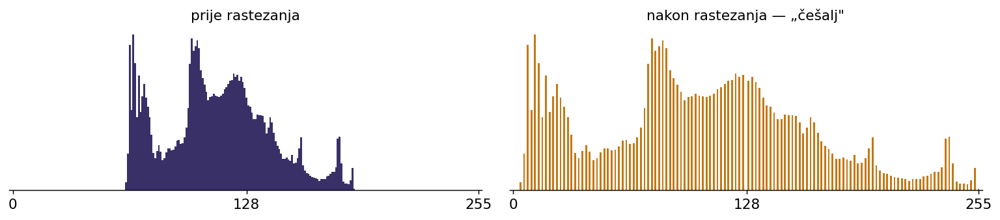{width=100%}

- 8-bitna slika ima samo 256 mogućih vrijednosti
- Rastezanjem se one razmiču --- između njih ostaju **prazni stupci**
- Pravilan uzorak rupa i šiljaka („češalj") otkriva da je kontrast mijenjan, čak i kada slika okom izgleda prirodno

# Konvolucija i korelacija

## Klizni prozor

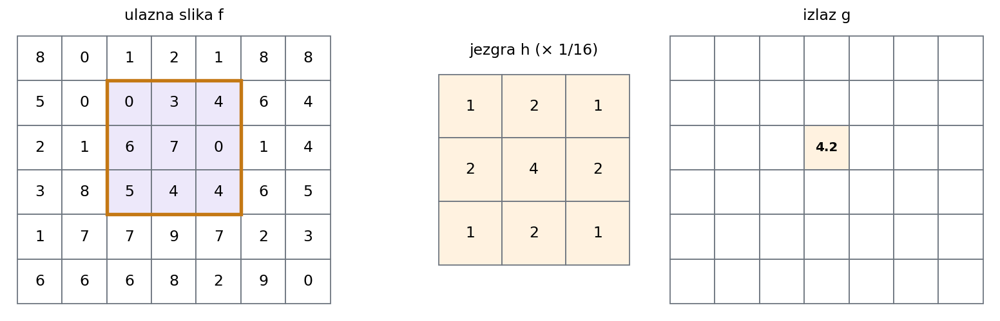{width=90%}

- Prozor (jezgra) klizi preko slike; izlaz je **težinska suma** piksela ispod prozora

$$g(m, n) = \sum_{j}\sum_{k} h(j, k)\, f(m - j,\, n - k)$$

## Konvolucija i korelacija

- **Konvolucija** --- jezgra se prije množenja rotira za 180°
- **Korelacija** --- ista operacija bez rotacije:

$$g(m, n) = \sum_{j}\sum_{k} h(j, k)\, f(m + j,\, n + k)$$

- Za simetrične jezgre rezultat je isti
- Na rubovima nedostaju pikseli → **dopunjavanje** (nule, rub, zrcaljenje)

```python
k = np.array([[1, 2, 1], [2, 4, 2], [1, 2, 1]], np.float32) / 16
g = cv2.filter2D(img, -1, k, borderType=cv2.BORDER_REFLECT)
```

\begin{deklaracija}
\texttt{cv2.filter2D} računa korelaciju --- nesimetričnu jezgru treba prethodno rotirati.
\end{deklaracija}

## Korelacija kao mjera sličnosti

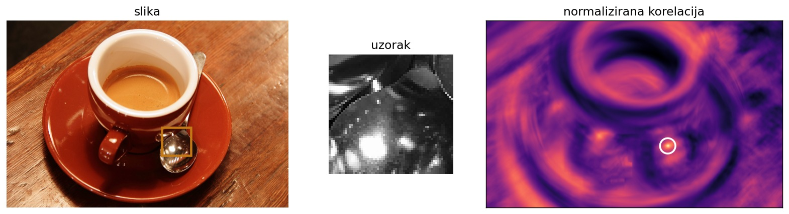{width=100%}

- **Normalizirana korelacija** mjeri koliko je dio slike sličan zadanom uzorku
- Najveća vrijednost pokazuje gdje se uzorak nalazi
- Isti princip koristi se za otkrivanje **kloniranih** dijelova slike (copy-move)

## Primjeri filtara

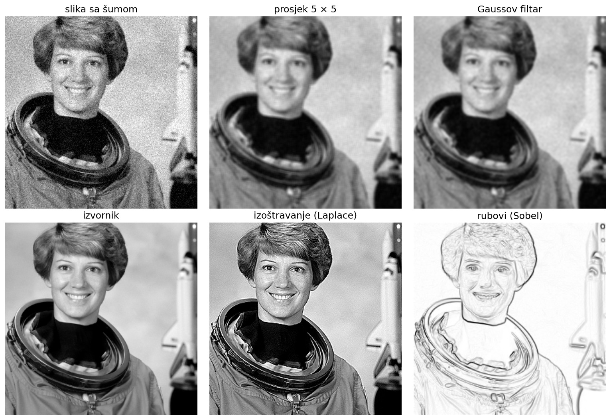{height=88%}

## Statistički nelinearni filtri

- **Filtri poretka** (*order-statistic filters*): izlazna vrijednost ovisi o **redoslijedu** vrijednosti piksela u prozoru
    - **medijan** --- srednja po redu vrijednost
    - **max** --- najveća vrijednost
    - **min** --- najmanja vrijednost
- Nisu linearni: ne mogu se zapisati kao težinska suma, dakle ni kao konvolucija

## Medijan filtar

- Pikseli unutar prozora sortiraju se po veličini, a izlaz je **srednja** vrijednost po redu

\begin{center}
\begin{tabular}{|c|c|c|}\hline 123 & 112 & 131 \\ \hline 118 & \textbf{243} & 129 \\ \hline 121 & 230 & 117 \\ \hline\end{tabular}
\qquad$\longrightarrow$\qquad
\begin{tabular}{|c|c|c|}\hline 123 & 112 & 131 \\ \hline 118 & \textbf{123} & 129 \\ \hline 121 & 230 & 117 \\ \hline\end{tabular}

\vspace{1.5ex}
{\small sortirano: \; 112 \; 117 \; 118 \; 121 \; \textbf{123} \; 129 \; 131 \; 230 \; 243}
\end{center}

\begin{deklaracija}
Medijan filtar dobro uklanja točkasti šum (\textit{salt \& pepper}) i pritom čuva rubove regija.
\end{deklaracija}

## Medijan i usrednjavanje

\begin{center}
\parbox[t]{0.18\textwidth}{\centering\includegraphics[width=\linewidth]{slike/p02_median_ulaz.jpg}\\[0.2ex]{\scriptsize ulazna slika}}\hspace{0.01\textwidth}%
\parbox[t]{0.18\textwidth}{\centering\includegraphics[width=\linewidth]{slike/p02_median_blur3.jpg}\\[0.2ex]{\scriptsize usrednjavanje 3 × 3}}\hspace{0.01\textwidth}%
\parbox[t]{0.18\textwidth}{\centering\includegraphics[width=\linewidth]{slike/p02_median_gauss3.jpg}\\[0.2ex]{\scriptsize Gaussov filtar 3 × 3}}\hspace{0.01\textwidth}%
\parbox[t]{0.18\textwidth}{\centering\includegraphics[width=\linewidth]{slike/p02_median_med3.jpg}\\[0.2ex]{\scriptsize medijan 3 × 3}}

\vspace{0.6ex}
\parbox[t]{0.18\textwidth}{\centering\includegraphics[width=\linewidth]{slike/p02_median_sum.jpg}\\[0.2ex]{\scriptsize 75 \% šuma (\textit{s\&p})}}\hspace{0.01\textwidth}%
\parbox[t]{0.18\textwidth}{\centering\includegraphics[width=\linewidth]{slike/p02_median_blur9.jpg}\\[0.2ex]{\scriptsize usrednjavanje 9 × 9}}\hspace{0.01\textwidth}%
\parbox[t]{0.18\textwidth}{\centering\includegraphics[width=\linewidth]{slike/p02_median_gauss9.jpg}\\[0.2ex]{\scriptsize Gaussov filtar 9 × 9}}\hspace{0.01\textwidth}%
\parbox[t]{0.18\textwidth}{\centering\includegraphics[width=\linewidth]{slike/p02_median_med9.jpg}\\[0.2ex]{\scriptsize medijan 9 × 9}}
\end{center}

## Konvolucija u forenzici

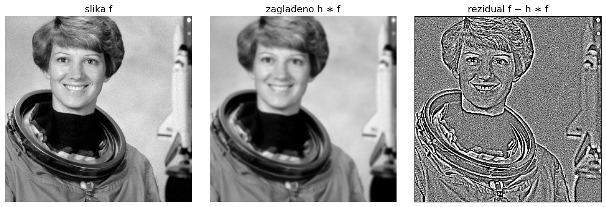{width=88%}

- Zaglađivanjem se procjenjuje „čisti" sadržaj slike
- Oduzimanjem ostaje **rezidual**: šum i fini detalji
- U šumu se krije **otisak senzora** --- jedinstven za svaki fotoaparat

# Zaključak

## Ključno za forenziku

- Svaki korak nastanka i obrade slike ostavlja trag:
    - **demozaikiranje** --- korelacija susjednih piksela
    - **obrada u kameri** --- potpis proizvođača
    - **promjena kontrasta** --- „češalj" u histogramu
    - **skaliranje i rotacija** --- tragovi interpolacije
    - **šum senzora** --- otisak uređaja
- **Sljedeće predavanje (P3):** matematički model slike i digitalni formati --- prostori boja, zapis slike, JPEG, JFIF i EXIF
